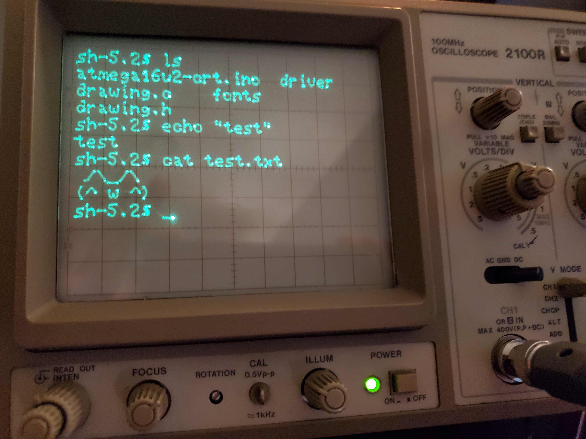
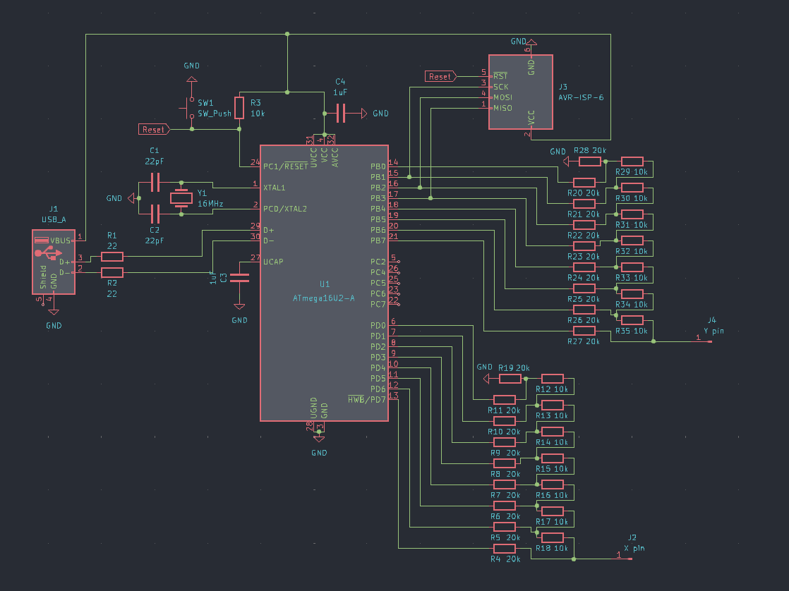
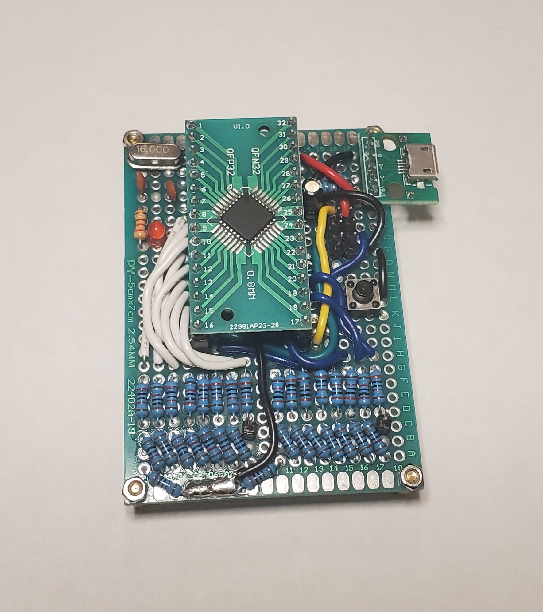
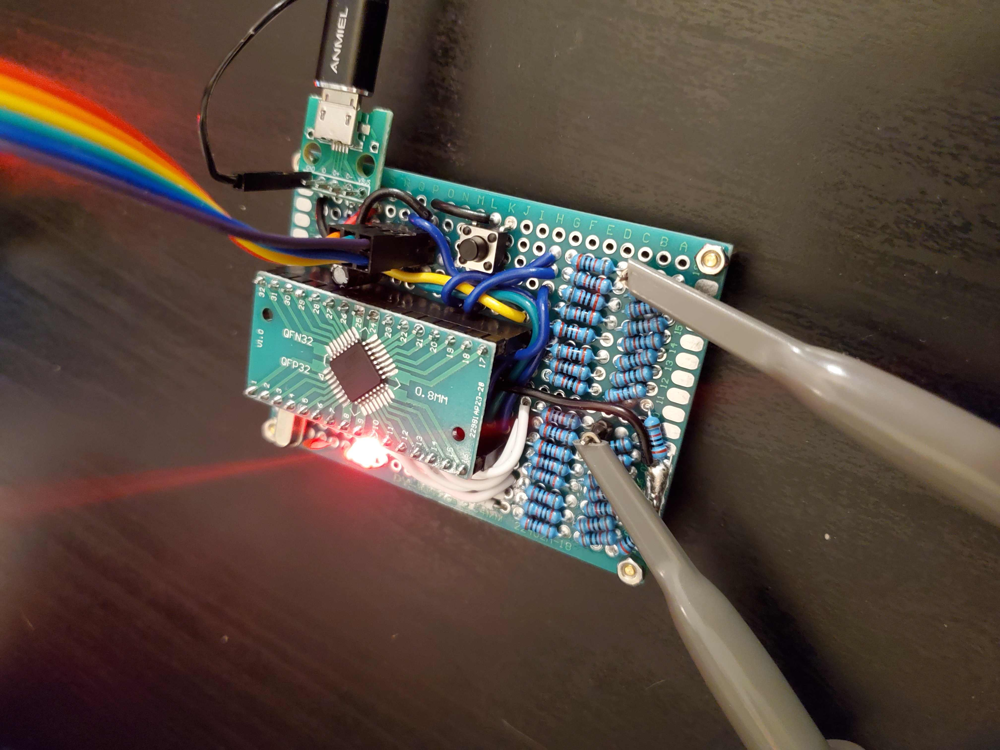

# Atmega16u2 USB CRT

> A USB Device to Drive Oscilloscopes as CRT Terminals Using the Atmega16u2 and Dual R-2R DACs
- [SETUP](#SETUP)
- [USAGE](#USAGE)
- [ABOUT](#ABOUT)
- [FONTS](#FONTS)



<br clear="left"/>
<br clear="left"/>


# SETUP
Hookup the supporting hardware and DAC circuits and as shown in the schematic below. `Port D` controls the X axis and `Port B` the Y axis (the Y axis is inverted). 


<br clear="left"/>
<br clear="left"/>

Below is my finished prototype board, I'm using a breakout board for the Atmega16u2:



<br clear="left"/>
<br clear="left"/>


# USAGE
For first time setup (on Linux), run the following to create a UDEV rule and set the fuses on the Atmega16u2 (both only need to be done once):
``` 
./driver/udev.sh
./firmware/fuses.sh
```

Firmware can be compiled and uploaded using:
```
./firmware/upload.sh
```

Finally to get a shell on the oscilloscope, run:
``` 
./driver/shell.sh
```

Hit `Ctrl-d` to exit the shell.


# ABOUT

### Beam Control
The oscilloscope beam is steered by dual R-2R DACs which are controlled by direct port manipulation, hence beam move commands take a total of 4 clock cycles (2 cycles for each port). As the beam cannot be turned off, characters are drawn by going over them twice, so they appear much brighter than the lines which connect them.

Interrupts are disabled while drawing to the screen to prevent jitter caused by variable timing.

### Font processing
Font processing uses a graph traversal algorithm written in python (see the python files in `./firmware/fonts`). The algorithm converts a pixel font into a vector representation that is then traversed by the oscilloscope beam to draw the characters to the screen. The generated header files in `./firmware/fonts/processed` contain this vector representation which is loaded into program memory. Each char is loaded into RAM as it is written, loading everything would far eclipse the 512 Bytes of SRAM on the Atmega16u2.

### Memory 
As mentioned, fonts are stored in program memory and loaded as needed. First we load the character's data from an array (who's indices correspond to ASCII values), this character data contains offsets into a larger array that contains the actual beam moves needed to draw the character. To support segmented characters (IE : = ; !), multiple offsets can be stored for each segment. Some additional metadata is stored in character data, for example character width so we can support non-monospace fonts, as well as the first beam location so we can move the beam to the starting spot before loading the full character (lessens the bright spots caused by the beam being parked for too long).

The text displayed on the screen is stored in a circle buffer that is populated by incoming USB packets, this leads to a max number of characters that can be on the screen at once due to RAM limitations (which dictate the size of this circle buffer).

Lastly a buffer is set aside for incoming USB traffic, as well as a small buffer used to process ANSI escape sequences.

### Terminal emulation
Incoming text is processed to support ASCII control characters and some ANSI escape sequences. In addition non-supported ANSI escape sequences (IE color codes) are filtered out.


# FONTS
Selecting a processed font is done by importing it in `./firmware/drawing.h` for example: `#include "fonts/processed/pet-extended.h"`.

Additional fonts can be added by placing them in the `./firmware/fonts/yaff` or `./firmware/fonts/json` directories, yaff fonts can be found [here](https://github.com/robhagemans/hoard-of-bitfonts), json fonts can be found here [here](https://github.com/rsms/sigi-pixel-font). These fonts are parsed and converted into a vector font whenever `./firmware/upload.sh` is run, generating header files in `./firmware/fonts/processed`.

